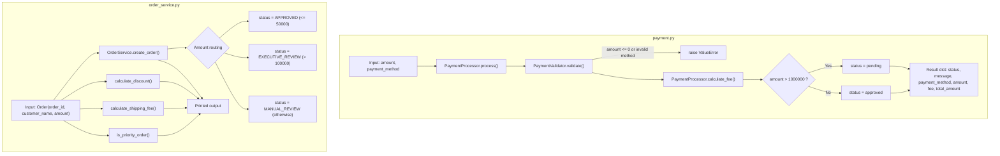

# Project Documentation

## 1. Drift Analysis

> ⚠️ **MAJOR DOCUMENTATION DRIFT DETECTED**

The current pull request introduces a new module, `order_service.py`, whose implementation materially diverges from business rules referenced in code comments and in the previously implied Order Management documentation. Multiple business-logic thresholds and rates differ from the documented rules.

The comparison below uses the previously documented/annotated rules (as evidenced by the in-code drift annotations describing "Old documented rule" / "Old docs") against the CURRENT implementation.

### Drift Item: Auto-approval limit changed

* **Severity:** MAJOR
* **Area:** Business Logic
* **Affected File:** `order_service.py`
* **Affected Function/Class:** `OrderService.AUTO_APPROVAL_LIMIT` / `OrderService.create_order`
* **Previous Documentation:** Orders were auto-approved up to ₹25,000 (`AUTO_APPROVAL_LIMIT = 25_000`).
* **Current Code Behavior:** Orders are auto-approved up to ₹50,000 (`AUTO_APPROVAL_LIMIT = 50_000`).
* **Evidence:** Diff changes `AUTO_APPROVAL_LIMIT = 25_000` to `AUTO_APPROVAL_LIMIT = 50_000`, with in-code comment "Old documented rule: ₹25,000 / New business rule: ₹50,000".
* **Documentation Action:** Business Logic and Components sections updated to state the auto-approval limit is now ₹50,000.

### Drift Item: New executive-review status transition

* **Severity:** MAJOR
* **Area:** Business Logic / Status Transitions
* **Affected File:** `order_service.py`
* **Affected Function/Class:** `OrderService.create_order`
* **Previous Documentation:** Order status resolution had only `APPROVED` (auto) and `MANUAL_REVIEW` (fallback).
* **Current Code Behavior:** Orders above ₹100,000 are now set to `EXECUTIVE_REVIEW` with message "Order requires executive review". Only orders that are neither auto-approved nor above ₹100,000 fall into `MANUAL_REVIEW`.
* **Evidence:** Diff adds `elif order.amount > 100_000: order.status = "EXECUTIVE_REVIEW"`.
* **Documentation Action:** Added `EXECUTIVE_REVIEW` status and updated status-transition logic in Business Logic and Data Flow.

### Drift Item: Discount rate for mid-tier orders changed

* **Severity:** MAJOR
* **Area:** Business Logic / Calculation
* **Affected File:** `order_service.py`
* **Affected Function/Class:** `OrderService.calculate_discount`
* **Previous Documentation:** Orders from ₹10,000 to ₹50,000 received a 5% discount.
* **Current Code Behavior:** Orders from ₹10,000 to ₹50,000 receive a 10% discount (`discount_rate = 0.10`). Orders above ₹50,000 also receive 10%.
* **Evidence:** Diff adds `calculate_discount` with `elif order.amount <= 50_000: discount_rate = 0.10` and comment "Old documented rule: 5% / Current implementation: 10%".
* **Documentation Action:** Added discount business rules describing the current 0% / 10% / 10% tiers.

### Drift Item: Free-shipping threshold changed

* **Severity:** MAJOR
* **Area:** Business Logic / Calculation
* **Affected File:** `order_service.py`
* **Affected Function/Class:** `OrderService.calculate_shipping_fee`
* **Previous Documentation:** Free shipping applied above ₹25,000.
* **Current Code Behavior:** Free shipping (fee `0`) applies when `order.amount >= 50_000`; otherwise a flat fee of `500`.
* **Evidence:** Diff adds `return 0 if order.amount >= 50_000 else 500` with comment "Old docs: free shipping above ₹25,000 / Current rule: free shipping above ₹50,000".
* **Documentation Action:** Added shipping-fee business rule reflecting the ₹50,000 free-shipping threshold.

### Drift Item: Priority-order threshold changed

* **Severity:** MAJOR
* **Area:** Business Logic
* **Affected File:** `order_service.py`
* **Affected Function/Class:** `OrderService.is_priority_order`
* **Previous Documentation:** Priority applied to orders above ₹100,000.
* **Current Code Behavior:** An order is priority when `order.amount > 75_000`.
* **Evidence:** Diff adds `return order.amount > 75_000` with comment "Old docs: priority above ₹100,000 / Current rule: priority above ₹75,000".
* **Documentation Action:** Added priority-order business rule reflecting the ₹75,000 threshold.

### Minor Drift

* The `main()` demonstration block in `order_service.py` contains two `Order` instances that share the same `order_id` (`ORD-004`). Observed from code; noted as a data-quality issue in the example, not a business-rule drift.

---

**Note on `payment.py`:** The current PR does not modify `payment.py`. All previously documented payment-processing behavior remains valid and is preserved unchanged below.

## 2. Overview

This repository is at an early/prototype stage and consists of standalone Python scripts with no external framework integration, no persistence layer, and no networking code.

Relevant files:

- `test.txt` — a plain text file with sample content, unrelated to application logic.
- `payment.py` — a small Python script implementing payment validation and processing logic, including payment-method-aware fee calculation, an approval threshold check, and payment-method validation via an `Enum`. (Note: earlier documentation referred to this script as `testpayment.py`; the currently supplied change set modifies a file named `payment.py` with the same `PaymentValidator`/`PaymentProcessor` structure. This appears to be the same module evolved/renamed; the rename itself is not explicitly evidenced in the supplied diff, so it is noted here as inferred.)
- `order_service.py` — a standalone Python script implementing order-creation, approval-workflow, discount, shipping-fee, and priority-order business logic. It defines an `Order` data class-like object and an `OrderService` orchestrator.

There is no evidence of a web framework, server, database, or API layer in the supplied code.

## 3. Architecture

The supplied code consists of standalone Python scripts with no external framework integration, no persistence layer, and no networking code.

**Payment module (`payment.py`)** — a simple procedural/object-oriented script composed of:

- `PaymentMethod` — an `Enum` defining the supported payment methods (`UPI`, `CARD`, `BANK_TRANSFER`).
- `PaymentValidator` — static validation utility, validating both the amount and the payment method.
- `PaymentProcessor` — orchestrates validation, computes a payment-method-specific fee via `calculate_fee`, computes the total amount, and returns a result dictionary including status, message, and payment method.

The payment script executes top-level code that instantiates `PaymentProcessor` and calls `process()` directly when run, passing an amount and a `PaymentMethod` value, and printing the result to stdout.

**Order module (`order_service.py`)** — a separate, independent standalone script composed of:

- `Order` — a simple object holding `order_id`, `customer_name`, `amount`, and a mutable `status`.
- `OrderService` — orchestrates order creation/approval decisions and provides discount, shipping-fee, and priority calculations.

The order script executes a `main()` function when run directly that instantiates `OrderService`, iterates over a list of sample `Order` objects, and prints creation results, discounts, shipping fees, and priority flags to stdout.

The two modules are independent; no cross-module integration is evidenced.

## 4. APIs

No HTTP APIs, endpoints, or web routes are evidenced in the supplied code.

`payment.py` exposes only in-process Python classes/methods (not network-accessible):

- `PaymentValidator.validate(amount, payment_method)` — static method, not an HTTP API.
- `PaymentProcessor.calculate_fee(amount, payment_method)` — instance method, not an HTTP API.
- `PaymentProcessor.process(amount, payment_method)` — instance method, not an HTTP API.

`order_service.py` exposes only in-process Python classes/methods (not network-accessible):

- `OrderService.create_order(order)` — instance method, not an HTTP API.
- `OrderService.calculate_discount(order)` — instance method, not an HTTP API.
- `OrderService.calculate_shipping_fee(order)` — instance method, not an HTTP API.
- `OrderService.is_priority_order(order)` — instance method, not an HTTP API.

## 5. Business Logic

### 5.1 Payment Processing (`payment.py`)

The core payment business logic is implemented in `payment.py`:

- **Payment methods**: Supported payment methods are defined by the `PaymentMethod` enum: `UPI`, `CARD`, and `BANK_TRANSFER`.
- **Validation rule (amount)**: A payment `amount` must be strictly greater than zero. If `amount <= 0`, a `ValueError` is raised with the message `"Amount must be greater than zero"`.
- **Validation rule (payment method)**: The `payment_method` argument must be an instance of the `PaymentMethod` enum. If it is not, a `ValueError` is raised with the message `"Invalid payment method"`.
- **Fee calculation (payment-method-specific)**: The processing fee is computed based on the payment method via `PaymentProcessor.FEE_RATES`:
  - `UPI`: `1%` (`0.01`)
  - `CARD`: `2%` (`0.02`)
  - `BANK_TRANSFER`: `0.5%` (`0.005`)

  The fee is computed as `round(amount * rate, 2)`, where `rate` is looked up from `FEE_RATES` using the given `payment_method`.
- **Total amount**: `total_amount = amount + fee`.
- **Approval threshold rule**: If `amount > 1000000`, the payment is not immediately approved — the result status is `"pending"` with the message `"Manager approval required"`. (The threshold value itself remains `1,000,000`; only its literal representation in code changed from `1_000_000` to `1000000`, a formatting change with no effect on behavior.)
- **Default approval**: If the amount is within the valid range and does not exceed the threshold, the result status is `"approved"` with the message `"Payment processed successfully"`.
- **Result payload**: Regardless of status, the result includes the resolved `payment_method` (as its string `.value`), in addition to `status`, `message`, `amount`, `fee`, and `total_amount`.

#### Payment Processing Flow

1. `PaymentProcessor.process(amount, payment_method)` is called with a numeric amount and a `PaymentMethod` enum member.
2. `PaymentValidator.validate(amount, payment_method)` checks:
   - `amount > 0`; raises `ValueError("Amount must be greater than zero")` otherwise.
   - `payment_method` is a `PaymentMethod` instance; raises `ValueError("Invalid payment method")` otherwise.
3. `PaymentProcessor.calculate_fee(amount, payment_method)` looks up the fee rate for the given payment method from `FEE_RATES` and computes `fee = round(amount * rate, 2)`.
4. `total_amount = amount + fee` is computed.
5. If `amount > 1000000`, `status = "pending"` and `message = "Manager approval required"`.
6. Otherwise, `status = "approved"` and `message = "Payment processed successfully"`.
7. A result dictionary is returned containing `status`, `message`, `payment_method` (string value), `amount`, `fee`, and `total_amount`.

### 5.2 Order Processing (`order_service.py`)

The order business logic is implemented in `order_service.py`.

- **Auto-approval limit**: `OrderService.AUTO_APPROVAL_LIMIT = 50_000` (₹50,000). *(Updated from the previously documented ₹25,000 — see Drift Analysis.)*
- **Order status resolution** (in `create_order`):
  - If `order.amount <= AUTO_APPROVAL_LIMIT` (≤ ₹50,000): `status = "APPROVED"`, message `"Order automatically approved"`.
  - Else if `order.amount > 100_000` (> ₹100,000): `status = "EXECUTIVE_REVIEW"`, message `"Order requires executive review"`. *(Newly introduced status transition.)*
  - Else (₹50,000 < amount ≤ ₹100,000): `status = "MANUAL_REVIEW"`, message `"Order requires manual review"`.
- **create_order result payload**: Returns a dictionary containing `order_id`, `status`, and `message`.

  > Observed from code: the diff shows the return dictionary includes `"message"` and, from the surrounding unchanged context, `order_id` and `status`. The exact full set of returned keys beyond those shown in the diff is inferred from the surrounding structure.

- **Discount calculation** (`calculate_discount`):
  - Orders below ₹10,000 (`amount < 10_000`): `discount_rate = 0` (no discount).
  - Orders from ₹10,000 up to and including ₹50,000 (`amount <= 50_000`): `discount_rate = 0.10` (10%). *(Updated from the previously documented 5% — see Drift Analysis.)*
  - Orders above ₹50,000: `discount_rate = 0.10` (10%).
  - `discount_amount = order.amount * discount_rate`; `final_amount = order.amount - discount_amount`.
  - Returns a dictionary containing `order_id`, `original_amount`, `discount_rate`, `discount_amount`, and `final_amount`.

- **Shipping fee** (`calculate_shipping_fee`):
  - Free shipping (fee `0`) when `order.amount >= 50_000` (≥ ₹50,000). *(Updated from the previously documented ₹25,000 threshold — see Drift Analysis.)*
  - Otherwise, a flat fee of `500`.

- **Priority order** (`is_priority_order`):
  - Returns `True` when `order.amount > 75_000` (> ₹75,000); `False` otherwise. *(Updated from the previously documented ₹100,000 threshold — see Drift Analysis.)*

#### Order Processing Flow

1. `OrderService.create_order(order)` is called with an `Order` object.
2. Status is resolved:
   - `amount <= 50_000` → `APPROVED`.
   - `amount > 100_000` → `EXECUTIVE_REVIEW`.
   - otherwise → `MANUAL_REVIEW`.
3. A result dictionary (including `status` and `message`) is returned.
4. Independently, callers may invoke:
   - `calculate_discount(order)` → discount breakdown dictionary.
   - `calculate_shipping_fee(order)` → `0` or `500`.
   - `is_priority_order(order)` → boolean priority flag.

## 6. Components

### `PaymentMethod`
- **Type**: `Enum`.
- **Members**: `UPI = "UPI"`, `CARD = "CARD"`, `BANK_TRANSFER = "BANK_TRANSFER"`.
- **Purpose**: Restricts the set of valid payment methods accepted by `PaymentValidator` and `PaymentProcessor`.

### `PaymentValidator`
- **Type**: Class with a single static method.
- **Method**: `validate(amount, payment_method)` — raises `ValueError` if `amount <= 0` (`"Amount must be greater than zero"`), and raises `ValueError` if `payment_method` is not an instance of `PaymentMethod` (`"Invalid payment method"`). Otherwise performs no action (implicitly valid).

### `PaymentProcessor`
- **Type**: Class encapsulating payment processing.
- **Class attribute**: `FEE_RATES` — a dict mapping each `PaymentMethod` to its fee rate (`UPI`: `0.01`, `CARD`: `0.02`, `BANK_TRANSFER`: `0.005`).
- **Method**: `calculate_fee(self, amount, payment_method)` — looks up the rate for `payment_method` in `FEE_RATES` and returns `round(amount * rate, 2)`.
- **Method**: `process(self, amount, payment_method)`:
  - Validates the amount and payment method via `PaymentValidator.validate`.
  - Calculates `fee` via `calculate_fee` and computes `total_amount`.
  - Determines `status` and `message` based on the approval threshold (`amount > 1000000`).
  - Returns a dictionary describing the outcome (`status`, `message`, `payment_method` (string value), `amount`, `fee`, `total_amount`).

### `Order`
- **Type**: Class representing an order.
- **Attributes** (observed from usage): `order_id`, `customer_name`, `amount`, and a mutable `status` set during processing.
- **Purpose**: Data holder passed to `OrderService` methods.

### `OrderService`
- **Type**: Class encapsulating order-workflow business logic.
- **Class attribute**: `AUTO_APPROVAL_LIMIT = 50_000` — the maximum amount eligible for automatic approval.
- **Method**: `create_order(self, order)` — resolves the order `status` to `APPROVED`, `EXECUTIVE_REVIEW`, or `MANUAL_REVIEW` based on the amount, sets a message, and returns a result dictionary.
- **Method**: `calculate_discount(self, order)` — computes a discount breakdown based on the order amount and returns a dictionary with `order_id`, `original_amount`, `discount_rate`, `discount_amount`, and `final_amount`.
- **Method**: `calculate_shipping_fee(self, order)` — returns `0` for amounts ≥ ₹50,000, else `500`.
- **Method**: `is_priority_order(self, order)` — returns `True` for amounts > ₹75,000, else `False`.

### Script-level execution

**`payment.py`**
- Instantiates `processor = PaymentProcessor()`.
- Calls `processor.process(30000, PaymentMethod.UPI)`. (Previously `60000`; the example invocation amount was changed but the underlying processing logic and outcome — `"approved"` status, since the amount remains well below the 1,000,000 threshold — are unaffected.)
- Prints the resulting dictionary to standard output.

**`order_service.py`**
- Defines `main()`, instantiates `service = OrderService()`.
- Iterates over a list of sample `Order` objects:
  - `ORD-001` (Rahul, ₹25,000) — below approval threshold → `APPROVED`.
  - `ORD-002` (Priya, ₹75,000) — → `MANUAL_REVIEW`.
  - `ORD-003` (Amit, ₹150,000) — → `EXECUTIVE_REVIEW`.
  - `ORD-004` (Amit2, ₹15,000) — → `APPROVED`.
  - `ORD-004` (Amit3, ₹15,000) — duplicate `order_id`; → `APPROVED`. *(Minor drift: duplicate `order_id`.)*
- For each order, prints the creation result, the discount breakdown, and a dictionary containing `order_id`, `shipping_fee`, and `priority`.
- Executes `main()` under `if __name__ == "__main__":`.

### `test.txt`
- A non-code text file containing two lines: `test` and `check 1 -1`. No functional role evidenced; appears to be a test/placeholder artifact.

## 7. Data Flow

### Payment data flow (`payment.py`)

```
amount, payment_method (input)
   │
   ▼
PaymentValidator.validate(amount, payment_method)
   ├── amount <= 0            ──▶ raises ValueError("Amount must be greater than zero")
   └── not a PaymentMethod    ──▶ raises ValueError("Invalid payment method")
   ▼
PaymentProcessor.calculate_fee(amount, payment_method)
   │   rate = FEE_RATES[payment_method]   (UPI=0.01, CARD=0.02, BANK_TRANSFER=0.005)
   │   fee = round(amount * rate, 2)
   ▼
total_amount = amount + fee
   │
   ▼
amount > 1000000 ?
   ├── Yes ──▶ {status: "pending",  message: "Manager approval required",       payment_method, amount, fee, total_amount}
   └── No  ──▶ {status: "approved", message: "Payment processed successfully",  payment_method, amount, fee, total_amount}
```

### Order data flow (`order_service.py`)

```
Order(order_id, customer_name, amount) (input)
   │
   ▼
OrderService.create_order(order)
   ├── amount <= 50_000   ──▶ status="APPROVED",         message="Order automatically approved"
   ├── amount > 100_000   ──▶ status="EXECUTIVE_REVIEW", message="Order requires executive review"
   └── otherwise          ──▶ status="MANUAL_REVIEW",    message="Order requires manual review"
   ▼
{order_id, status, message}

Independent calculations (per order):
OrderService.calculate_discount(order)
   ├── amount < 10_000    ──▶ discount_rate = 0
   ├── amount <= 50_000   ──▶ discount_rate = 0.10
   └── otherwise          ──▶ discount_rate = 0.10
   ▼
{order_id, original_amount, discount_rate, discount_amount, final_amount}

OrderService.calculate_shipping_fee(order)  ──▶ 0 if amount >= 50_000 else 500
OrderService.is_priority_order(order)       ──▶ True if amount > 75_000 else False
```

Data flows entirely in-memory within a single process execution; there is no external I/O, persistence, or network transmission evidenced.

## 8. Configuration

No configuration files, environment variables, or settings are evidenced in the supplied code.

- The per-method fee rates in `payment.py` (`UPI`: `0.01`, `CARD`: `0.02`, `BANK_TRANSFER`: `0.005`) are hard-coded as a class-level dictionary (`PaymentProcessor.FEE_RATES`), not externalized as configuration.
- The payment approval threshold (`1000000`) is a hard-coded literal within `PaymentProcessor.process`, not externalized as configuration.
- The order auto-approval limit (`AUTO_APPROVAL_LIMIT = 50_000`), executive-review threshold (`100_000`), discount tiers (`10_000`, `50_000`, rate `0.10`), free-shipping threshold (`50_000`), flat shipping fee (`500`), and priority threshold (`75_000`) in `order_service.py` are all hard-coded literals within `OrderService`, not externalized as configuration.

## 9. Error Handling

### Payment (`payment.py`)
- `PaymentValidator.validate(amount, payment_method)` raises `ValueError` with message `"Amount must be greater than zero"` when `amount <= 0`.
- `PaymentValidator.validate(amount, payment_method)` raises `ValueError` with message `"Invalid payment method"` when `payment_method` is not an instance of the `PaymentMethod` enum.
- Both exceptions propagate uncaught from `PaymentProcessor.process`, meaning callers must handle them themselves (no try/except is present in the supplied script).
- `PaymentProcessor.calculate_fee` will raise a `KeyError` if called with a `payment_method` not present in `FEE_RATES`; however, since `validate` is called before `calculate_fee` in `process` and rejects non-`PaymentMethod` values, this scenario is not reachable through the normal `process` flow given the currently defined enum members.
- No other error handling (e.g., type validation for non-numeric amounts) is present.

### Order (`order_service.py`)
- No explicit exception raising or try/except handling is evidenced in `order_service.py`.
- `create_order`, `calculate_discount`, `calculate_shipping_fee`, and `is_priority_order` perform numeric comparisons on `order.amount` and assume a numeric value; no input validation is present. Non-numeric amounts would raise a `TypeError` at comparison time (inferred from Python semantics; not explicitly handled in code).

## 10. Dependencies

- `payment.py` imports `Enum` from the Python standard library (`enum` module) to define `PaymentMethod`. No third-party libraries, frameworks, or external services are evidenced.
- `order_service.py` uses only built-in Python constructs; no imports of third-party libraries, frameworks, or external services are evidenced in the supplied diff.

## 11. Usage

### Payment module

Run `payment.py` directly:

```
python payment.py
```

This instantiates `PaymentProcessor`, calls `process(30000, PaymentMethod.UPI)`, and prints the resulting dictionary. For `UPI` at ₹30,000: `fee = 300.0`, `total_amount = 30300.0`, `status = "approved"`.

### Order module

Run `order_service.py` directly:

```
python order_service.py
```

This instantiates `OrderService`, iterates over the sample orders, and prints:
- The `create_order` result (`order_id`, `status`, `message`).
- The `calculate_discount` breakdown.
- A dictionary of `order_id`, `shipping_fee`, and `priority`.

Expected sample outcomes (observed from code):
- `ORD-001` (₹25,000): `APPROVED`; discount 10% (₹2,500); shipping fee `500`; priority `False`.
- `ORD-002` (₹75,000): `MANUAL_REVIEW`; discount 10% (₹7,500); shipping fee `0`; priority `False`.
- `ORD-003` (₹150,000): `EXECUTIVE_REVIEW`; discount 10% (₹15,000); shipping fee `0`; priority `True`.
- `ORD-004` (₹15,000, Amit2 and Amit3): `APPROVED`; discount 10% (₹1,500); shipping fee `500`; priority `False`.

## 12. Architecture Diagram



The two modules are independent; there is no communication or shared state between `payment.py` and `order_service.py`.

## 13. Change Summary

### What Changed

- **New/expanded module `order_service.py`** (+89/-1):
  - `OrderService.AUTO_APPROVAL_L