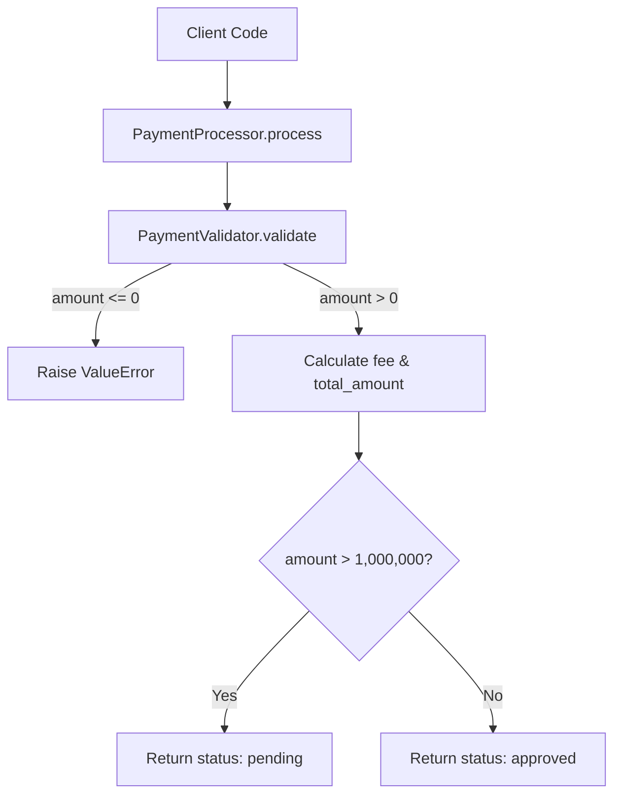

# Project Documentation

## 1. Overview

This repository, in its currently evidenced state, contains a small standalone Python module (`testpayment.py`) implementing basic payment validation and processing logic, along with an unrelated text file (`test.txt`) that appears to be used for testing a CI/CD or workflow mechanism. There is no evidence of a web framework, server, database, or API layer in the supplied code — the code is a plain Python script executed procedurally (module-level script execution).

## 2. Architecture

The supplied code does not evidence a multi-tier or service-oriented architecture. It consists of:

- A single Python file (`testpayment.py`) defining two classes and executing a script-level call.
- A single text file (`test.txt`) with no application logic, likely used to validate the PR/workflow process itself (per PR description: "Test PR to verify workflow").

No web server, routing framework, or persistence layer is present in the supplied code.

## 3. APIs

No HTTP endpoints, REST APIs, or network-facing interfaces are evidenced in the supplied code. `testpayment.py` is a script with in-process function/method calls only.

## 4. Business Logic

The business logic is contained entirely in `testpayment.py`:

- **Validation Rule**: A payment `amount` must be strictly greater than zero. If not, a `ValueError` is raised with the message `"Amount must be greater than zero"`.
- **Fee Calculation**: A processing fee is calculated as `2%` of the amount (`fee = amount * 0.02`).
- **Total Amount**: `total_amount = amount + fee`.
- **Approval Threshold Rule**: If `amount > 1000000`, the payment status is `"pending"` and requires manager approval. Otherwise, the payment status is `"approved"`.

### Processing Flow

1. `PaymentProcessor.process(amount)` is called.
2. `PaymentValidator.validate(amount)` is invoked first; raises `ValueError` if `amount <= 0`.
3. Fee and total amount are computed.
4. If `amount > 1000000`, return a dict with `status: "pending"` and a manager-approval message.
5. Otherwise, return a dict with `status: "approved"`.

## 5. Components

### `PaymentValidator`
- **Type**: Class with a single static method.
- **Method**: `validate(amount)` — raises `ValueError` if `amount <= 0`; otherwise no-op.

### `PaymentProcessor`
- **Type**: Class encapsulating payment processing logic.
- **Method**: `process(self, amount)`:
  - Validates the amount via `PaymentValidator`.
  - Computes `fee` (2% of amount) and `total_amount`.
  - Returns a dictionary describing the payment outcome (`status`, `amount`, `fee`, `total_amount`, and optionally `message` for pending payments).

### Script-level execution
- `processor = PaymentProcessor()`
- `result = processor.process(50000)`
- `print(result)`

This indicates the file is currently runnable as a standalone script (not wrapped in `if __name__ == "__main__":`), meaning importing this module will execute the script logic and print output as a side effect.

## 6. Data Flow

```
amount (input)
   │
   ▼
PaymentValidator.validate(amount) ──► raises ValueError if invalid
   │
   ▼
PaymentProcessor.process(amount)
   │
   ├── fee = amount * 0.02
   ├── total_amount = amount + fee
   │
   ▼
amount > 1,000,000?
   ├── Yes ──► {status: "pending", message: "Manager approval required", amount, fee, total_amount}
   └── No  ──► {status: "approved", amount, fee, total_amount}
   │
   ▼
Returned dict (printed to stdout in script mode)
```

## 7. Configuration

No configuration files, environment variables, or settings are evidenced in the supplied code.

## 8. Error Handling

- `PaymentValidator.validate(amount)` raises a `ValueError` with message `"Amount must be greater than zero"` when `amount <= 0`.
- This exception propagates uncaught through `PaymentProcessor.process()` — there is no try/except handling in the supplied code, so callers must handle the exception themselves.
- No other error/exception handling is present in the supplied code.

## 9. Dependencies

No external dependencies are evidenced in the supplied code. `testpayment.py` uses only Python built-ins.

## 10. Usage

```python
from testpayment import PaymentProcessor

processor = PaymentProcessor()

# Standard approved payment
result = processor.process(50000)
print(result)
# {'status': 'approved', 'amount': 50000, 'fee': 1000.0, 'total_amount': 51000.0}

# Payment requiring manager approval
result = processor.process(2_000_000)
print(result)
# {'status': 'pending', 'message': 'Manager approval required', 'amount': 2000000, 'fee': 40000.0, 'total_amount': 2040000.0}

# Invalid payment
try:
    processor.process(0)
except ValueError as e:
    print(e)  # "Amount must be greater than zero"
```

## 11. Architecture Diagram



## 12. Change Summary

### 12.1 What Changed

- Added `test.txt` containing two lines of plain text (`test`, `check 1 -1`), with no application logic.
- Added `testpayment.py`, introducing:
  - `PaymentValidator` class with a static `validate(amount)` method that raises `ValueError` for non-positive amounts.
  - `PaymentProcessor` class with a `process(amount)` method that validates the amount, calculates a 2% processing fee, computes a total amount, and returns a status dict (`"approved"` or `"pending"` based on a 1,000,000 threshold).
  - Script-level execution instantiating `PaymentProcessor`, calling `process(50000)`, and printing the result.

### 12.2 Why It Changed

Per the PR description: "Test PR to verify workflow." The PR is explicitly a test to validate a CI/CD or automation workflow (also referenced by title "Get check name" and closes issue #1). The specific business logic in `testpayment.py` (fee calculation, approval threshold) is not explained by any PR description or code comments beyond the inline comment `# New functionality: calculate processing fee`. Deeper motivation for the payment logic itself is: "Not evidenced in supplied context."

### 12.3 Impacted Modules

- **`test.txt`** (new file): No functional impact; likely used to trigger/verify workflow behavior.
- **`testpayment.py`** (new file): Introduces new `PaymentValidator` and `PaymentProcessor` classes and associated payment processing business logic; this is a net-new module with no prior version to compare against.

### 12.4 API / Interface Changes

No HTTP or network-facing API changes are evidenced. New Python-level interfaces introduced:

- `PaymentValidator.validate(amount: numeric) -> None` — raises `ValueError` on invalid input.
- `PaymentProcessor.process(self, amount: numeric) -> dict` — returns a dict with keys `status`, `amount`, `fee`, `total_amount`, and conditionally `message`.

These are newly added interfaces (no prior version existed), not modifications to existing ones.

### 12.5 Configuration Changes

None evidenced.

### 12.6 Expected Behavior

**Observed from code:**
- Running `testpayment.py` as a script executes `processor.process(50000)` and prints the resulting dict to stdout.
- For `amount = 50000`: fee = `1000.0`, total_amount = `51000.0`, status = `"approved"`.
- Importing `testpayment.py` as a module will trigger the script-level execution (instantiation, processing, and print) as a side effect, since there is no `if __name__ == "__main__":` guard.

**Inferred:**
- The `test.txt` file is likely intended solely to exercise a CI check (e.g., a "check name" reporting workflow) rather than to affect application behavior. (Inferred)

### 12.7 Backward Compatibility

Both files are newly added; there is no prior version of `testpayment.py` or `test.txt` in the repository based on supplied evidence, so there are no backward-compatibility concerns for existing callers. Note that since `testpayment.py` executes logic at import time (no `__main__` guard), any future code that imports this module will trigger unintended side effects (printing to stdout, running a full "50000" transaction) — this could affect integration behavior once this module is reused elsewhere.

### 12.8 Testing Requirements

Based on the evidenced logic in `testpayment.py`, the following tests should be added:

- **Validation edge cases**:
  - `amount = 0` → expect `ValueError`.
  - `amount < 0` (e.g., `-1`) → expect `ValueError`.
  - `amount > 0` (e.g., `1`) → expect no exception.

- **Fee and total calculation**:
  - Verify `fee == amount * 0.02` for typical values.
  - Verify `total_amount == amount + fee`.

- **Approval threshold boundary tests**:
  - `amount == 1000000` → expect `status == "approved"` (since condition is strictly `> 1000000`).
  - `amount == 1000001` → expect `status == "pending"` with message `"Manager approval required"`.

- **Return structure verification**:
  - Confirm dict contains expected keys (`status`, `amount`, `fee`, `total_amount`, and `message` only when pending).

- **Regression risk**:
  - Since the module executes code at import time, any test importing `testpayment` will trigger the hardcoded `process(50000)` call and print output — tests should mock/capture stdout or refactor the script execution behind a `__main__` guard to avoid unintended side effects during test collection.