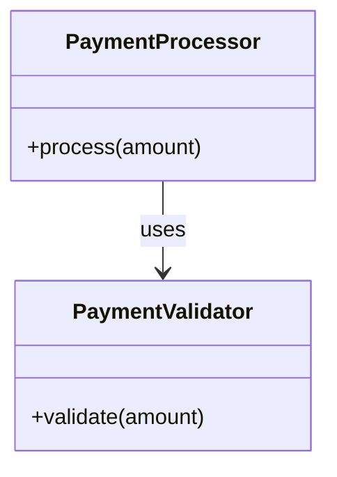

# Project Documentation

## 1. Overview

This repository contains a small Python module, `payment.py`, implementing a `PaymentProcessor` class that processes payment amounts and determines whether a payment is automatically approved or requires manager approval based on a threshold. The module also validates the payment amount via a `PaymentValidator` component (referenced but not defined in the supplied code).

## 2. Architecture

The code is a single-file, script-style module with a simple procedural/OOP structure:

- **`PaymentProcessor`** — core class encapsulating payment processing logic.
- **`PaymentValidator`** — external/companion class used for validating input amounts (referenced via `PaymentValidator.validate(amount)`, not defined in the supplied diff).
- **Script execution block** — instantiates `PaymentProcessor` and processes a hardcoded sample amount (`50000`), printing the result.

There is no evidence of a web framework, database, or external API layer in the supplied code — this is a plain Python module.

## 3. APIs

No HTTP APIs, routes, or web endpoints are evidenced in the supplied code. `payment.py` exposes only an in-process Python class interface.

## 4. Business Logic

The core business rule implemented in `PaymentProcessor.process`:

1. Validate the input `amount` using `PaymentValidator.validate(amount)`.
2. If `amount > 1000000`, the payment is **pending** and requires manager approval.
3. Otherwise, the payment is **approved**.

```python
def process(self, amount):
    PaymentValidator.validate(amount)

    if amount > 1000000:
        return {
            "status": "pending",
            "message": "Manager approval required",
            "amount": amount,
        }

    return {
        "status": "approved",
        "amount": amount,
    }
```

**Threshold rule (post-change):** Amounts strictly greater than `1,000,000` require manager approval; amounts at or below this threshold are automatically approved.

## 5. Components

### `PaymentProcessor`
- **Method:** `process(self, amount)`
  - **Input:** `amount` (numeric)
  - **Output:** `dict` with keys:
    - `status`: `"approved"` or `"pending"`
    - `amount`: the input amount
    - `message` (only present when `status == "pending"`): `"Manager approval required"`

Previously (pre-change), the class contained two private helper methods, `_pending(self, amount)` and `_approved(self, amount)`, which built these response dictionaries. These have been removed and inlined directly into `process`.

### `PaymentValidator`
- Referenced via `PaymentValidator.validate(amount)`.
- Not defined in the supplied code; assumed to be an external/companion class responsible for validating the amount before processing.

## 6. Data Flow

1. Caller invokes `processor.process(amount)`.
2. `PaymentValidator.validate(amount)` is called to validate the input (implementation not shown).
3. Based on the amount, a result dictionary is constructed inline and returned:
   - `amount > 1000000` → pending result.
   - otherwise → approved result.
4. The script-level code prints the result of processing a hardcoded amount (`50000`).

```mermaid
flowchart TD
    A[Call process(amount)] --> B[PaymentValidator.validate(amount)]
    B --> C{amount > 1000000?}
    C -- Yes --> D[Return status=pending, message, amount]
    C -- No --> E[Return status=approved, amount]
```

## 7. Configuration

No configuration files, environment variables, or externalized settings are evidenced in the supplied code. The approval threshold (`1000000`) is a hardcoded literal within `process`.

## 8. Error Handling

No explicit error handling (e.g., try/except) is present in the supplied code. Error handling behavior, if any, depends on the unseen implementation of `PaymentValidator.validate`, which is expected to raise on invalid input but this is not confirmed by the supplied code.

## 9. Dependencies

No external libraries or package imports are shown in the supplied diff. `PaymentValidator` is referenced but its source/module is not included in the supplied code.

## 10. Usage

```python
processor = PaymentProcessor()

result = processor.process(50000)

print(result)
# Example output: {"status": "approved", "amount": 50000}
```

## 11. Architecture Diagram



## 12. Change Summary

### 12.1 What Changed

- The manager-approval threshold in `PaymentProcessor.process` was raised from `amount > 100000` to `amount > 1000000`.
- The private helper methods `_pending(self, amount)` and `_approved(self, amount)` were removed; their response-dictionary logic is now inlined directly into `process`.
- The `_approved` response dictionary is now the fallthrough return of `process` (no longer a separate method call).
- A trailing blank line was added before the `print(result)` statement, and the file's missing trailing newline issue is noted in the diff (`\ No newline at end of file`).

### 12.2 Why It Changed

Not evidenced in supplied context. No PR description, comments, or code comments explain the motivation for raising the threshold or removing the helper methods.

### 12.3 Impacted Modules

- **`payment.py`**
  - `PaymentProcessor.process`: threshold value changed and pending/approved response logic inlined.
  - `PaymentProcessor._pending`: removed.
  - `PaymentProcessor._approved`: removed.
  - Script execution block: formatting whitespace change (added blank line before `print(result)`).

### 12.4 API / Interface Changes

- **Removed (private/internal methods):**
  - `PaymentProcessor._pending(self, amount)` — no longer exists.
  - `PaymentProcessor._approved(self, amount)` — no longer exists.
- **Unchanged (public interface):** `PaymentProcessor.process(self, amount)` retains the same signature and return shape (`dict` with `status`, `amount`, and optionally `message`).

Since `_pending` and `_approved` were not prefixed as fully public (though not underscore-hidden via name mangling, they follow single-underscore "internal use" convention), their removal is an internal refactor rather than a public API break, assuming no external code called these methods directly.

### 12.5 Configuration Changes

None evidenced. The threshold value (`1000000`) remains a hardcoded literal in code, not an externalized configuration key.

### 12.6 Expected Behavior

- **Observed from code:** 
  - Payments with `amount > 1000000` now return `{"status": "pending", "message": "Manager approval required", "amount": amount}`.
  - Payments with `amount <= 1000000` return `{"status": "approved", "amount": amount}`.
  - The threshold for triggering pending/manager-approval status increased by 10x (from `100000` to `1000000`), meaning more payments will now be auto-approved than before the change.
  - The sample invocation `processor.process(50000)` will return an `"approved"` status under both old and new thresholds (no change in outcome for this specific test value).
- **Inferred:** Removing `_pending`/`_approved` as separate methods has no behavioral effect on `process`'s output — it is a code structure simplification, not a logic change beyond the threshold value.

### 12.7 Backward Compatibility

- **Public interface (`process`) is backward compatible:** same method signature, same return dictionary shape (keys: `status`, `amount`, `message` where applicable).
- **Threshold behavior change is not backward compatible for callers relying on the previous `100000` threshold:** any amount between `100001` and `1000000` that previously returned `"pending"` will now return `"approved"`. This is a **breaking behavioral change** for downstream logic/tests that assumed the old threshold.
- **Internal methods removed:** If any external code directly called `PaymentProcessor._pending` or `PaymentProcessor._approved` (not standard practice given the underscore convention, but possible), this would break.
- No data format, config, or integration changes are evidenced beyond the above.

### 12.8 Testing Requirements

- **Threshold boundary tests:**
  - `amount == 1000000` → should return `"approved"` (boundary, not `>`).
  - `amount == 1000001` → should return `"pending"`.
  - Previously-pending amounts now approved: test `amount` values between `100001` and `1000000` to confirm new `"approved"` behavior (regression check against old threshold expectations).
- **Existing sample regression test:** Confirm `processor.process(50000)` still returns `{"status": "approved", "amount": 50000}`.
- **Removed method regression:** Verify no external code/tests directly reference `PaymentProcessor._pending` or `PaymentProcessor._approved` (would now raise `AttributeError`).
- **Validation integration:** Confirm `PaymentValidator.validate(amount)` is still invoked and its error-handling behavior (if any) integrates correctly with the updated `process` flow.
- **Response shape test:** Ensure the returned dictionary structure (`status`, `amount`, `message`) is unchanged for both pending and approved paths.