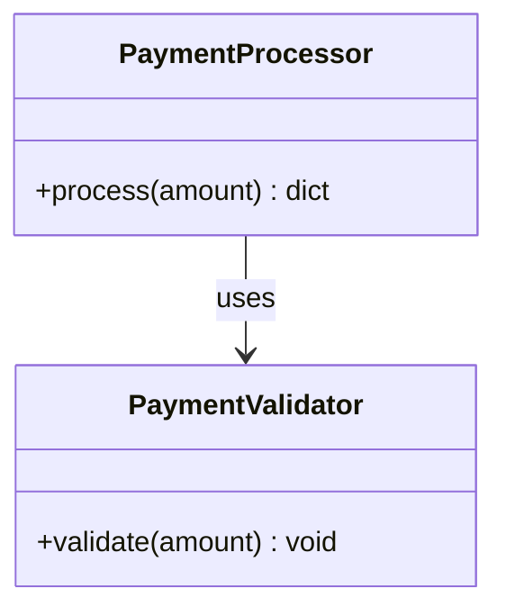

# Project Documentation

## 1. Overview

This repository, in its current state, contains a small standalone Python script implementing basic payment validation and processing logic, along with an unrelated plain-text test file. There is no evidence of a web framework, server, database, or external service integration in the supplied code. The codebase appears to be at an early/experimental stage.

## 2. Architecture

The supplied code consists of two independent, unrelated files:

- `testpayment.py`: A single Python module defining two classes (`PaymentValidator` and `PaymentProcessor`) and a script-level execution block that instantiates the processor and runs a sample payment.
- `test.txt`: A plain text file with arbitrary content, not part of the application logic.

There is no modular package structure, no configuration files, no API server, and no persistence layer evidenced in the supplied code. The architecture is a single-file procedural/OOP script executed top-to-bottom.

## 3. APIs

No HTTP APIs, endpoints, or network-exposed interfaces are evidenced in the supplied code. `testpayment.py` is a plain Python script with no web framework (e.g., Flask, FastAPI, Django) imports or route definitions.

## 4. Business Logic

The core business logic resides in `testpayment.py`:

- **Validation Rule**: A payment `amount` must be strictly greater than zero. If `amount <= 0`, a `ValueError` is raised with the message `"Amount must be greater than zero"`.
- **Fee Calculation**: A processing fee is calculated as `amount * 0.022` (2.2% of the amount).
- **Total Amount**: Computed as `amount + fee`.
- **Approval Threshold Rule**: 
  - If `amount > 1000000`, the payment status is `"pending"` and requires manager approval.
  - Otherwise, the payment status is `"approved"`.

## 5. Components

### `PaymentValidator`
A static utility class with a single method:

```python
class PaymentValidator:
    @staticmethod
    def validate(amount):
        if amount <= 0:
            raise ValueError("Amount must be greater than zero")
```
- **Purpose**: Enforces that payment amounts are positive.
- **Raises**: `ValueError` when validation fails.

### `PaymentProcessor`
A class encapsulating the payment processing workflow:

```python
class PaymentProcessor:
    def process(self, amount):
        PaymentValidator.validate(amount)
        fee = amount * 0.022
        total_amount = amount + fee

        if amount > 1000000:
            return {
                "status": "pending",
                "message": "Manager approval required",
                "amount": amount,
                "fee": fee,
                "total_amount": total_amount,
            }

        return {
            "status": "approved",
            "amount": amount,
            "fee": fee,
            "total_amount": total_amount,
        }
```
- **Purpose**: Validates and processes a payment amount, calculating fees and determining approval status.
- **Method**: `process(amount)` — returns a `dict` describing the outcome.

### Script Execution Block
```python
processor = PaymentProcessor()
result = processor.process(50000)
print(result)
```
- Instantiates `PaymentProcessor` and runs a sample payment of `50000`, printing the result dict to stdout.

## 6. Data Flow

1. A caller invokes `PaymentProcessor.process(amount)`.
2. `PaymentProcessor` delegates to `PaymentValidator.validate(amount)`.
   - If invalid (`amount <= 0`), a `ValueError` is raised and propagates to the caller (no try/except in this code).
3. If valid, the fee (`amount * 0.022`) and `total_amount` (`amount + fee`) are computed.
4. Based on the amount threshold (`1000000`), a result dictionary is constructed with either `"pending"` or `"approved"` status.
5. The result dictionary is returned to the caller; in the script's `__main__`-style execution, it is printed to stdout.

```mermaid
flowchart TD
    A[Call process(amount)] --> B[PaymentValidator.validate(amount)]
    B -->|amount <= 0| C[Raise ValueError]
    B -->|amount > 0| D[Calculate fee = amount * 0.022]
    D --> E[Calculate total_amount = amount + fee]
    E --> F{amount > 1000000?}
    F -->|Yes| G[Return status: pending]
    F -->|No| H[Return status: approved]
```

## 7. Configuration

No configuration files, environment variables, or settings modules are present in the supplied code. The fee rate (`0.022`) and approval threshold (`1000000`) are hard-coded literals within `testpayment.py`.

## 8. Error Handling

- `PaymentValidator.validate` raises a `ValueError("Amount must be greater than zero")` when `amount <= 0`.
- No exception handling (`try`/`except`) is present around the `process` call in the script; an invalid amount would propagate as an unhandled exception and terminate the script.
- No other error conditions (e.g., non-numeric input, `None` values) are validated in the supplied code.

## 9. Dependencies

No external dependencies (third-party libraries, frameworks) are imported or referenced in the supplied code. Only Python standard language features are used.

## 10. Usage

Example usage as evidenced by the script itself:

```python
from testpayment import PaymentProcessor

processor = PaymentProcessor()
result = processor.process(50000)
print(result)
# Expected output (observed from code logic):
# {'status': 'approved', 'amount': 50000, 'fee': 1100.0, 'total_amount': 51100.0}
```

Example triggering the pending/manager-approval path (inferred from code logic, not directly run in the diff):

```python
result = processor.process(1500000)
print(result)
# {'status': 'pending', 'message': 'Manager approval required',
#  'amount': 1500000, 'fee': 33000.0, 'total_amount': 1533000.0}
```

Example triggering validation failure (inferred from code logic):

```python
processor.process(-100)
# Raises ValueError: Amount must be greater than zero
```

## 11. Architecture Diagram



## 12. Change Summary

### 12.1 What Changed

- Added new file `testpayment.py` containing:
  - `PaymentValidator` class with a static `validate(amount)` method enforcing `amount > 0`.
  - `PaymentProcessor` class with a `process(amount)` method that validates input, computes a 2.2% processing fee, computes total amount, and returns a status dict (`"approved"` or `"pending"` based on a `1,000,000` threshold).
  - A script-level execution invoking `processor.process(50000)` and printing the result.
- Added new file `test.txt` containing two lines of arbitrary text (`test`, `check 1 -1`), unrelated to the payment logic.

### 12.2 Why It Changed

Not evidenced in supplied context. The PR title "Get check name" does not clearly explain the motivation, and no PR description or code comments provide explicit rationale beyond the inline comment `# New functionality: calculate processing fee` in `testpayment.py`.

### 12.3 Impacted Modules

- `testpayment.py` — new module introducing `PaymentValidator` and `PaymentProcessor` classes and a sample execution script.
- `test.txt` — new unrelated text file, no impact on application logic.

### 12.4 API / Interface Changes

- **New public interface**: `PaymentValidator.validate(amount)` — static method, raises `ValueError` if `amount <= 0`.
- **New public interface**: `PaymentProcessor.process(amount)` — instance method, returns a `dict` with keys `status`, `amount`, `fee`, `total_amount`, and (when pending) `message`.

These are newly introduced interfaces; no prior version existed in the supplied context, so there is no "before" state to compare.

### 12.5 Configuration Changes

None evidenced.

### 12.6 Expected Behavior

- **Observed from code**: Calling `PaymentProcessor.process(amount)` with `amount <= 0` raises `ValueError("Amount must be greater than zero")`.
- **Observed from code**: For `0 < amount <= 1000000`, the method returns a dict with `status: "approved"`, along with `amount`, `fee` (2.2% of amount), and `total_amount`.
- **Observed from code**: For `amount > 1000000`, the method returns a dict with `status: "pending"`, an added `message: "Manager approval required"`, plus `amount`, `fee`, and `total_amount`.
- **Observed from code**: Running the script directly executes `processor.process(50000)` and prints the resulting dict to stdout.
- **Inferred**: This module may be intended as a utility or test/demo script rather than a production-integrated component, given the file naming (`testpayment.py`) and accompanying unrelated `test.txt` file.

### 12.7 Backward Compatibility

Both files are newly added; there are no prior versions in the supplied context to compare against, so no breaking changes to existing functionality are evidenced. Whether this module is intended to integrate with any existing payment system or API is unknown from the supplied context.

### 12.8 Testing Requirements

Based on evidenced behavior in `testpayment.py`, the following tests should be added:

- **Validation tests**:
  - `PaymentValidator.validate` raises `ValueError` for `amount == 0`.
  - `PaymentValidator.validate` raises `ValueError` for negative `amount`.
  - `PaymentValidator.validate` does not raise for positive `amount`.
- **Fee calculation tests**:
  - Verify `fee == amount * 0.022` for representative amounts.
  - Verify `total_amount == amount + fee`.
- **Threshold/status tests**:
  - Amount exactly at `1000000` returns `status: "approved"` (boundary condition, since condition is `> 1000000`).
  - Amount at `1000001` (or greater) returns `status: "pending"` with `message: "Manager approval required"`.
- **Edge cases**:
  - Non-numeric input (e.g., string, `None`) — behavior not defined in code; test should confirm current behavior (likely `TypeError` from arithmetic operations) since no explicit type validation exists.
  - Very large amounts for potential floating-point precision issues in fee calculation.
- **Regression risk**: Since this is a new module, there is no prior behavior to regress against; future changes to the fee rate (`0.022`) or threshold (`1000000`) should be covered by these tests to detect unintended changes.
- **Unrelated file**: No tests applicable to `test.txt` as it contains no executable logic.