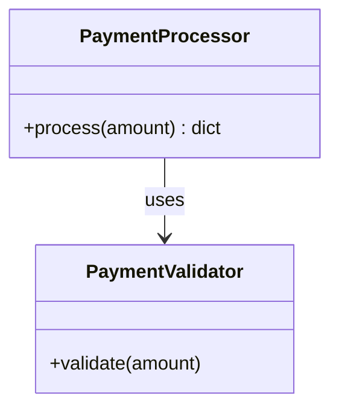

# Project Documentation

## 1. Overview

This repository contains a small Python module, `payment.py`, implementing a `PaymentProcessor` class responsible for processing payment amounts and determining whether a payment is automatically approved or requires manager approval based on a threshold amount. The module also validates input via a `PaymentValidator` class/dependency and includes a script-level execution example that processes a hardcoded amount and prints the result.

## 2. Architecture

The code is a single-module Python script with two main logical units:

- **`PaymentValidator`** — referenced but not defined in the supplied diff (assumed to be defined elsewhere in `payment.py` or imported). It exposes a `validate(amount)` method used to validate payment amounts before processing.
- **`PaymentProcessor`** — a class encapsulating the core business logic for processing a payment amount and returning a structured result dictionary.

The module also contains top-level script code that instantiates `PaymentProcessor` and runs a sample payment through it, printing the result to stdout.

## 3. APIs

No HTTP APIs, REST endpoints, or network-facing interfaces are present in the supplied code. This module exposes only in-process Python methods (not network APIs).

## 4. Business Logic

### Payment Processing Flow (`PaymentProcessor.process`)

1. Validate the `amount` using `PaymentValidator.validate(amount)`. (Validation logic itself is not shown in the diff.)
2. Apply an approval threshold rule:
   - If `amount > 10000`, the payment is marked as **pending**, requiring manager approval.
   - Otherwise, the payment is marked as **approved**.

**Business Rule Change (per this PR):**
- The approval threshold was lowered from `100000` to `10000`. Payments exceeding `10000` now require manager approval, whereas previously only payments exceeding `100000` did.

### Refactor: Removed Helper Methods

- The previous implementation used two private helper methods, `_pending(amount)` and `_approved(amount)`, to construct the response dictionaries.
- These helpers have been **inlined** directly into the `process` method:
  - The "pending" response dict is now constructed inline within the `if` branch.
  - The "approved" response dict is constructed inline as the fallback return value.

This is a code simplification/refactor with no change to the response structure — only the threshold value changed as a business-logic-affecting modification.

## 5. Components

### `PaymentProcessor`

A class responsible for orchestrating payment processing.

**Method: `process(self, amount)`**

- **Purpose:** Validates and evaluates a payment `amount`, returning a status dictionary indicating whether the payment is approved or pending manager approval.
- **Parameters:**
  - `amount` — the payment amount to process (numeric type, inferred from usage; exact type not enforced in shown code).
- **Returns:** A `dict` with the following possible shapes:

  Pending (amount > 10000):
  ```python
  {
      "status": "pending",
      "message": "Manager approval required",
      "amount": amount,
  }
  ```

  Approved (amount <= 10000):
  ```python
  {
      "status": "approved",
      "amount": amount,
  }
  ```

### `PaymentValidator`

- Referenced via `PaymentValidator.validate(amount)`.
- Not defined in the supplied diff; its implementation, validation rules, and exceptions are unknown from the provided evidence.

### Script-level Execution

At the bottom of the module:

```python
processor = PaymentProcessor()
result = processor.process(50000)
print(result)
```

This runs as a standalone example/demo when the module is executed directly (or on import, since it is not guarded by `if __name__ == "__main__":` in the shown code).

## 6. Data Flow

1. Caller invokes `PaymentProcessor.process(amount)`.
2. `amount` is passed to `PaymentValidator.validate(amount)` for validation (implementation not shown; assumed to raise or return based on validity, though not evidenced in this diff).
3. `process` compares `amount` against the threshold (`10000`).
4. A result dictionary is constructed and returned based on the comparison outcome.
5. In the script-level example, the returned dictionary is printed to standard output.

```mermaid
flowchart TD
    A[Caller calls process(amount)] --> B[PaymentValidator.validate(amount)]
    B --> C{amount > 10000?}
    C -->|Yes| D[Return status=pending, message=Manager approval required]
    C -->|No| E[Return status=approved]
```

## 7. Configuration

No external configuration (environment variables, config files, or settings) is present in the supplied code. The approval threshold (`10000`) is a hardcoded literal within `PaymentProcessor.process`.

## 8. Error Handling

No explicit error handling (try/except) is shown in the supplied diff. Any validation failures would presumably originate from `PaymentValidator.validate(amount)`, but that behavior is not visible in the provided code.

## 9. Dependencies

No external library imports are shown in the diff. The only dependency evidenced is the in-module (or same-file) reference to `PaymentValidator`, whose origin (local class, separate module, or import) is not shown in the supplied code.

## 10. Usage

Example usage, as shown in the module's script-level code:

```python
from payment import PaymentProcessor  # exact import path depends on repo structure

processor = PaymentProcessor()
result = processor.process(50000)
print(result)
# Example output for amount > 10000:
# {'status': 'pending', 'message': 'Manager approval required', 'amount': 50000}
```

For an amount at or below the threshold:

```python
result = processor.process(5000)
print(result)
# {'status': 'approved', 'amount': 5000}
```

## 11. Architecture Diagram

