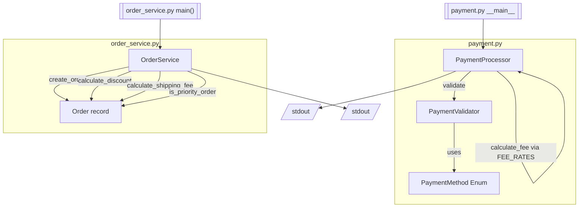

# Project Documentation

## 1. Drift Analysis

> ⚠️ **MAJOR DOCUMENTATION DRIFT DETECTED**

This repository now includes an order-management module (`order_service.py`) that materially changes several documented (and code-embedded) business rules. The following drift items are detected by comparing the previously documented rules (as evidenced in the code comments referencing "Old documented rule" / "Old docs") against the CURRENT implementation.

Note: The comments in `order_service.py` explicitly reference previously documented rules. These references are treated as evidence of prior documentation to compare against current code.

---

### Drift Item: Auto-approval limit changed from ₹25,000 to ₹50,000

* **Severity:** MAJOR
* **Area:** Business Logic
* **Affected File:** `order_service.py`
* **Affected Function/Class:** `OrderService.AUTO_APPROVAL_LIMIT` / `OrderService.create_order`
* **Previous Documentation:** Orders auto-approved when amount ≤ ₹25,000 (`AUTO_APPROVAL_LIMIT = 25_000`).
* **Current Code Behavior:** `AUTO_APPROVAL_LIMIT = 50_000`; orders are auto-approved when `order.amount <= 50_000`.
* **Evidence:** Diff changes `AUTO_APPROVAL_LIMIT = 25_000` → `AUTO_APPROVAL_LIMIT = 50_000`, with inline comment `# Old documented rule: ₹25,000 / New business rule: ₹50,000`.
* **Documentation Action:** Business Logic and Components sections updated to state the auto-approval limit is ₹50,000.

---

### Drift Item: New executive-review status for high-value orders

* **Severity:** MAJOR
* **Area:** Business Logic / Status Transitions
* **Affected File:** `order_service.py`
* **Affected Function/Class:** `OrderService.create_order`
* **Previous Documentation:** Orders were either `APPROVED` (auto-approval) or `MANUAL_REVIEW`. No executive-review state was documented.
* **Current Code Behavior:** Orders with `amount > 100_000` are set to status `EXECUTIVE_REVIEW` with message `"Order requires executive review"`. Orders above the auto-approval limit but at or below ₹100,000 fall into `MANUAL_REVIEW`.
* **Evidence:** Diff adds `elif order.amount > 100_000: order.status = "EXECUTIVE_REVIEW"`.
* **Documentation Action:** Business Logic, Components, and Data Flow updated to reflect three possible statuses and the new branching threshold.

---

### Drift Item: Discount rate for ₹10,000–₹50,000 orders changed from 5% to 10%

* **Severity:** MAJOR
* **Area:** Business Logic / Calculations
* **Affected File:** `order_service.py`
* **Affected Function/Class:** `OrderService.calculate_discount`
* **Previous Documentation:** Orders from ₹10,000 to ₹50,000 receive a 5% discount.
* **Current Code Behavior:** Orders from ₹10,000 to ₹50,000 receive a 10% discount (`discount_rate = 0.10`). Orders above ₹50,000 also receive 10%. Orders below ₹10,000 receive 0%.
* **Evidence:** Diff adds `calculate_discount` with `elif order.amount <= 50_000: discount_rate = 0.10` and inline comment `# Old documented rule: 5% / Current implementation: 10%`.
* **Documentation Action:** Business Logic and Components updated to describe current discount tiers.

---

### Drift Item: Free-shipping threshold changed from ₹25,000 to ₹50,000

* **Severity:** MAJOR
* **Area:** Business Logic / Calculations
* **Affected File:** `order_service.py`
* **Affected Function/Class:** `OrderService.calculate_shipping_fee`
* **Previous Documentation:** Free shipping for orders above ₹25,000.
* **Current Code Behavior:** Shipping fee is `0` when `order.amount >= 50_000`, otherwise `500`.
* **Evidence:** Diff adds `calculate_shipping_fee` returning `0 if order.amount >= 50_000 else 500`, with inline comment `# Old docs: free shipping above ₹25,000 / Current rule: free shipping above ₹50,000`.
* **Documentation Action:** Business Logic and Components updated to describe the ₹50,000 free-shipping threshold.

---

### Drift Item: Priority-order threshold changed from ₹100,000 to ₹75,000

* **Severity:** MAJOR
* **Area:** Business Logic
* **Affected File:** `order_service.py`
* **Affected Function/Class:** `OrderService.is_priority_order`
* **Previous Documentation:** Orders are priority above ₹100,000.
* **Current Code Behavior:** An order is priority when `order.amount > 75_000`.
* **Evidence:** Diff adds `is_priority_order` returning `order.amount > 75_000`, with inline comment `# Old docs: priority above ₹100,000 / Current rule: priority above ₹75,000`.
* **Documentation Action:** Business Logic and Components updated to describe the ₹75,000 priority threshold.

---

### Minor Drift

* The existing documentation focused only on `payment.py`. The order-management module (`order_service.py`) was previously undocumented; new sections have been added rather than replaced.

---

## 2. Overview

This repository is at an early/prototype stage and contains standalone Python scripts demonstrating business logic. There is no evidence of a web framework, server, database, or API layer.

The relevant application files are:

- `test.txt` — a plain text file with sample content, unrelated to application logic.
- `payment.py` — a small Python script implementing payment validation and processing logic, including payment-method-aware fee calculation, an approval threshold check, and payment-method validation via an `Enum`. (Note: earlier documentation referred to this script as `testpayment.py`; the current module has the same `PaymentValidator`/`PaymentProcessor` structure. This appears to be the same module evolved/renamed; the rename itself is not explicitly evidenced, so it is noted here as inferred.)
- `order_service.py` — a standalone Python script implementing order-management business logic: order creation with status assignment, discount calculation, shipping-fee calculation, and priority determination.

The supplied code consists of standalone Python scripts with no external framework integration, no persistence layer, and no networking code.

## 3. Architecture

The architecture is a simple procedural/object-oriented set of standalone scripts.

**Payment module (`payment.py`)** is composed of:

- `PaymentMethod` — an `Enum` defining the supported payment methods (`UPI`, `CARD`, `BANK_TRANSFER`).
- `PaymentValidator` — static validation utility, validating both the amount and the payment method.
- `PaymentProcessor` — orchestrates validation, computes a payment-method-specific fee via `calculate_fee`, computes the total amount, and returns a result dictionary including status, message, and payment method.

The payment script executes top-level code that instantiates `PaymentProcessor` and calls `process()` directly when run, passing an amount and a `PaymentMethod` value, and printing the result to stdout.

**Order module (`order_service.py`)** is a separate, independent standalone script composed of:

- `Order` — a data class/record representing an order (`order_id`, `customer_name`, `amount`, and a mutable `status`).
- `OrderService` — encapsulates order-management business logic: order creation with status assignment (`create_order`), discount calculation (`calculate_discount`), shipping-fee calculation (`calculate_shipping_fee`), and priority determination (`is_priority_order`).

The order script executes a `main()` function that instantiates `OrderService`, creates several sample orders, and prints creation results, discounts, shipping fees, and priority flags to stdout.

Both scripts run entirely in-memory within a single process; there is no external I/O, persistence, or network transmission evidenced.

## 4. APIs

No HTTP APIs, endpoints, or web routes are evidenced in the supplied code.

`payment.py` exposes only in-process Python classes/methods (not network-accessible):

- `PaymentValidator.validate(amount, payment_method)` — static method, not an HTTP API.
- `PaymentProcessor.calculate_fee(amount, payment_method)` — instance method, not an HTTP API.
- `PaymentProcessor.process(amount, payment_method)` — instance method, not an HTTP API.

`order_service.py` exposes only in-process Python classes/methods (not network-accessible):

- `OrderService.create_order(order)` — instance method, not an HTTP API.
- `OrderService.calculate_discount(order)` — instance method, not an HTTP API.
- `OrderService.calculate_shipping_fee(order)` — instance method, not an HTTP API.
- `OrderService.is_priority_order(order)` — instance method, not an HTTP API.

## 5. Business Logic

### 5.1 Payment Processing (`payment.py`)

The core payment business logic is implemented in `payment.py`:

- **Payment methods**: Supported payment methods are defined by the `PaymentMethod` enum: `UPI`, `CARD`, and `BANK_TRANSFER`.
- **Validation rule (amount)**: A payment `amount` must be strictly greater than zero. If `amount <= 0`, a `ValueError` is raised with the message `"Amount must be greater than zero"`.
- **Validation rule (payment method)**: The `payment_method` argument must be an instance of the `PaymentMethod` enum. If it is not, a `ValueError` is raised with the message `"Invalid payment method"`.
- **Fee calculation (payment-method-specific)**: The processing fee is computed based on the payment method via `PaymentProcessor.FEE_RATES`:
  - `UPI`: `1%` (`0.01`)
  - `CARD`: `2%` (`0.02`)
  - `BANK_TRANSFER`: `0.5%` (`0.005`)

  The fee is computed as `round(amount * rate, 2)`, where `rate` is looked up from `FEE_RATES` using the given `payment_method`.
- **Total amount**: `total_amount = amount + fee`.
- **Approval threshold rule**: If `amount > 1000000`, the payment is not immediately approved — the result status is `"pending"` with the message `"Manager approval required"`. (The threshold value remains `1,000,000`.)
- **Default approval**: If the amount is within the valid range and does not exceed the threshold, the result status is `"approved"` with the message `"Payment processed successfully"`.
- **Result payload**: Regardless of status, the result includes the resolved `payment_method` (as its string `.value`), in addition to `status`, `message`, `amount`, `fee`, and `total_amount`.

#### Processing Flow (Payment)

1. `PaymentProcessor.process(amount, payment_method)` is called with a numeric amount and a `PaymentMethod` enum member.
2. `PaymentValidator.validate(amount, payment_method)` checks:
   - `amount > 0`; raises `ValueError("Amount must be greater than zero")` otherwise.
   - `payment_method` is a `PaymentMethod` instance; raises `ValueError("Invalid payment method")` otherwise.
3. `PaymentProcessor.calculate_fee(amount, payment_method)` looks up the fee rate and computes `fee = round(amount * rate, 2)`.
4. `total_amount = amount + fee` is computed.
5. If `amount > 1000000`, `status = "pending"` and `message = "Manager approval required"`.
6. Otherwise, `status = "approved"` and `message = "Payment processed successfully"`.
7. A result dictionary is returned containing `status`, `message`, `payment_method` (string value), `amount`, `fee`, and `total_amount`.

### 5.2 Order Management (`order_service.py`)

The order-management business logic is implemented in `order_service.py`.

- **Auto-approval limit** (`AUTO_APPROVAL_LIMIT`): `₹50,000`. *(Changed from ₹25,000 — see Drift Analysis.)*
- **Order status assignment** (`create_order`): The order status is determined by amount:
  - `amount <= 50_000` → status `"APPROVED"`, message `"Order automatically approved"`.
  - `amount > 100_000` → status `"EXECUTIVE_REVIEW"`, message `"Order requires executive review"`. *(New rule — see Drift Analysis.)*
  - Otherwise (`50_000 < amount <= 100_000`) → status `"MANUAL_REVIEW"`, message `"Order requires manual review"`.
- **Discount calculation** (`calculate_discount`):
  - `amount < 10_000` → discount rate `0` (no discount).
  - `10_000 <= amount <= 50_000` → discount rate `0.10` (10%). *(Changed from 5% — see Drift Analysis.)*
  - `amount > 50_000` → discount rate `0.10` (10%).
  - `discount_amount = amount * discount_rate`; `final_amount = amount - discount_amount`.
- **Shipping fee** (`calculate_shipping_fee`): Free shipping (`0`) when `amount >= 50_000`; otherwise a flat fee of `500`. *(Free-shipping threshold changed from ₹25,000 — see Drift Analysis.)*
- **Priority order** (`is_priority_order`): An order is priority when `amount > 75_000`. *(Threshold changed from ₹100,000 — see Drift Analysis.)*

#### Processing Flow (Order)

1. `OrderService.create_order(order)` is called with an `Order` instance.
2. Status is assigned:
   - `amount <= 50_000` → `"APPROVED"`.
   - `amount > 100_000` → `"EXECUTIVE_REVIEW"`.
   - otherwise → `"MANUAL_REVIEW"`.
3. A result dictionary is returned (containing at least `order_id`, `status`, and `message`).
4. `calculate_discount(order)` computes the discount tier and returns `order_id`, `original_amount`, `discount_rate`, `discount_amount`, and `final_amount`.
5. `calculate_shipping_fee(order)` returns `0` or `500` based on the ₹50,000 threshold.
6. `is_priority_order(order)` returns a boolean based on the ₹75,000 threshold.

## 6. Components

### `PaymentMethod`
- **Type**: `Enum`.
- **Members**: `UPI = "UPI"`, `CARD = "CARD"`, `BANK_TRANSFER = "BANK_TRANSFER"`.
- **Purpose**: Restricts the set of valid payment methods accepted by `PaymentValidator` and `PaymentProcessor`.

### `PaymentValidator`
- **Type**: Class with a single static method.
- **Method**: `validate(amount, payment_method)` — raises `ValueError` if `amount <= 0` (`"Amount must be greater than zero"`), and raises `ValueError` if `payment_method` is not an instance of `PaymentMethod` (`"Invalid payment method"`). Otherwise performs no action (implicitly valid).

### `PaymentProcessor`
- **Type**: Class encapsulating payment processing.
- **Class attribute**: `FEE_RATES` — a dict mapping each `PaymentMethod` to its fee rate (`UPI`: `0.01`, `CARD`: `0.02`, `BANK_TRANSFER`: `0.005`).
- **Method**: `calculate_fee(self, amount, payment_method)` — looks up the rate for `payment_method` in `FEE_RATES` and returns `round(amount * rate, 2)`.
- **Method**: `process(self, amount, payment_method)`:
  - Validates the amount and payment method via `PaymentValidator.validate`.
  - Calculates `fee` via `calculate_fee` and computes `total_amount`.
  - Determines `status` and `message` based on the approval threshold (`amount > 1000000`).
  - Returns a dictionary describing the outcome (`status`, `message`, `payment_method` (string value), `amount`, `fee`, `total_amount`).

### `Order`
- **Type**: Data record for an order.
- **Fields**: `order_id`, `customer_name`, `amount`, and a mutable `status` (assigned during `create_order`).
- **Purpose**: Represents a single order passed to `OrderService` methods.

### `OrderService`
- **Type**: Class encapsulating order-management logic.
- **Class attribute**: `AUTO_APPROVAL_LIMIT = 50_000` — the maximum amount for automatic approval.
- **Method**: `create_order(self, order)` — assigns `order.status` based on amount thresholds (`APPROVED` ≤ ₹50,000; `EXECUTIVE_REVIEW` > ₹100,000; otherwise `MANUAL_REVIEW`) and returns a result dictionary with `order_id`, `status`, and `message`.
- **Method**: `calculate_discount(self, order)` — returns a dictionary with `order_id`, `original_amount`, `discount_rate`, `discount_amount`, and `final_amount`. Discount tiers: `<₹10,000` → 0%; `₹10,000–₹50,000` → 10%; `>₹50,000` → 10%.
- **Method**: `calculate_shipping_fee(self, order)` — returns `0` if `amount >= 50_000`, otherwise `500`.
- **Method**: `is_priority_order(self, order)` — returns `True` if `amount > 75_000`, otherwise `False`.

### Script-level execution

**`payment.py`**
- Instantiates `processor = PaymentProcessor()`.
- Calls `processor.process(30000, PaymentMethod.UPI)`. (Previously `60000`; the example invocation amount was changed but the underlying processing logic and outcome — `"approved"` status, since the amount remains well below the 1,000,000 threshold — are unaffected.)
- Prints the resulting dictionary to standard output.

**`order_service.py`**
- Defines a `main()` function that instantiates `service = OrderService()`.
- Creates sample orders:
  - `ORD-001` (Rahul, ₹25,000) — below/at approval threshold → `APPROVED`.
  - `ORD-002` (Priya, ₹75,000) → `MANUAL_REVIEW`.
  - `ORD-003` (Amit, ₹150,000) → `EXECUTIVE_REVIEW`.
  - `ORD-004` (Amit2, ₹15,000) → `APPROVED`.
- For each order, prints the creation result, the discount result, and a dictionary containing `order_id`, `shipping_fee`, and `priority`.
- Executes `main()` under `if __name__ == "__main__":`.

### `test.txt`
- A non-code text file containing two lines: `test` and `check 1 -1`. No functional role evidenced; appears to be a test/placeholder artifact.

## 7. Data Flow

### Payment Data Flow

```
amount, payment_method (input)
   │
   ▼
PaymentValidator.validate(amount, payment_method)
   ├── amount <= 0            ──▶ raises ValueError("Amount must be greater than zero")
   └── not a PaymentMethod    ──▶ raises ValueError("Invalid payment method")
   ▼
PaymentProcessor.calculate_fee(amount, payment_method)
   │   rate = FEE_RATES[payment_method]   (UPI=0.01, CARD=0.02, BANK_TRANSFER=0.005)
   │   fee = round(amount * rate, 2)
   ▼
total_amount = amount + fee
   │
   ▼
amount > 1000000 ?
   ├── Yes ──▶ {status: "pending",  message: "Manager approval required",       payment_method, amount, fee, total_amount}
   └── No  ──▶ {status: "approved", message: "Payment processed successfully",  payment_method, amount, fee, total_amount}
```

### Order Data Flow

```
Order(order_id, customer_name, amount) (input)
   │
   ▼
OrderService.create_order(order)
   ├── amount <= 50_000   ──▶ status = "APPROVED"         message = "Order automatically approved"
   ├── amount > 100_000   ──▶ status = "EXECUTIVE_REVIEW" message = "Order requires executive review"
   └── otherwise          ──▶ status = "MANUAL_REVIEW"    message = "Order requires manual review"
   │
   ▼
OrderService.calculate_discount(order)
   ├── amount < 10_000    ──▶ discount_rate = 0
   ├── amount <= 50_000   ──▶ discount_rate = 0.10
   └── amount > 50_000    ──▶ discount_rate = 0.10
   │   discount_amount = amount * discount_rate
   │   final_amount = amount - discount_amount
   ▼
OrderService.calculate_shipping_fee(order)
   │   0 if amount >= 50_000 else 500
   ▼
OrderService.is_priority_order(order)
   │   True if amount > 75_000 else False
   ▼
printed output (status, discount, shipping_fee, priority)
```

Data flows entirely in-memory within a single process execution; there is no external I/O, persistence, or network transmission evidenced.

## 8. Configuration

No configuration files, environment variables, or settings are evidenced in the supplied code.

- The per-method payment fee rates (`UPI`: `0.01`, `CARD`: `0.02`, `BANK_TRANSFER`: `0.005`) are hard-coded as a class-level dictionary (`PaymentProcessor.FEE_RATES`), not externalized as configuration.
- The payment approval threshold (`1000000`) is a hard-coded literal within `PaymentProcessor.process`, not externalized as configuration.
- The order auto-approval limit (`AUTO_APPROVAL_LIMIT = 50_000`) is a hard-coded class attribute on `OrderService`, not externalized as configuration.
- The order executive-review threshold (`100_000`), free-shipping threshold (`50_000`), flat shipping fee (`500`), discount tiers/rates, and priority threshold (`75_000`) are hard-coded literals within `OrderService` methods, not externalized as configuration.

## 9. Error Handling

**Payment module:**
- `PaymentValidator.validate(amount, payment_method)` raises a `ValueError` with message `"Amount must be greater than zero"` when `amount <= 0`.
- `PaymentValidator.validate(amount, payment_method)` raises a `ValueError` with message `"Invalid payment method"` when `payment_method` is not an instance of the `PaymentMethod` enum.
- Both exceptions propagate uncaught from `PaymentProcessor.process`, meaning callers must handle them themselves (no try/except is present in the supplied script).
- `PaymentProcessor.calculate_fee` will raise a `KeyError` if called with a `payment_method` not present in `FEE_RATES`; however, since `validate` is called before `calculate_fee` in `process` and rejects non-`PaymentMethod` values, this scenario is not reachable through the normal `process` flow given the currently defined enum members.
- No other error handling (e.g., type validation for non-numeric amounts) is present in the payment code.

**Order module:**
- No explicit error handling (no `raise`, try/except) is evidenced in `order_service.py`. Methods assume `order.amount` is numeric and comparable.
- `Order` construction and `OrderService` methods do not validate their inputs; invalid/missing fields would raise standard Python errors uncaught.

## 10. Dependencies

- `payment.py` imports `Enum` from the Python standard library (`enum` module) to define `PaymentMethod`.
- `order_service.py` uses only standard Python constructs; no imports beyond standard library are evidenced.
- No third-party libraries, frameworks, or external services are evidenced in the supplied code.

## 11. Usage

**Payment script:**
Run `payment.py` directly to execute its script-level example, which processes a sample payment of `30000` via `PaymentMethod.UPI` and prints the resulting dictionary.

**Order script:**
Run `order_service.py` directly (or invoke `main()`) to execute its example, which creates several sample orders (`ORD-001` through `ORD-004`), then prints each order's creation result, discount result, and a summary containing `order_id`, `shipping_fee`, and `priority`.

Both modules' classes may also be imported and used programmatically in-process.

## 12. Architecture Diagram



The two modules are independent standalone scripts with no communication between them; each runs entirely in-memory and prints to stdout.

## 13. Change Summary

### What Changed

- **`OrderService.AUTO_APPROVAL_LIMIT`** changed from `25_000` to `50_000`.
- **`OrderService.create_order`** gained a new branch: orders with `amount > 100_000` are now assigned status `"EXECUTIVE_REVIEW"` with message `"Order requires executive review"`. Orders above the auto-approval limit but at or below ₹100,000 remain `MANUAL_REVIEW`.
- **New method `OrderService.calculate_discount(order)`** added, returning discount details. Discount tiers: `<₹10,000` → 0%; `₹10,000–₹50,000` → 10%; `>₹50,000` → 10%. The ₹10,000–₹50,000 tier's rate is 10% (the inline comment notes the previously documented rate was 5%).
- **New method `OrderService.calculate_shipping_fee(order)`** added, returning `0` if `amount >= 50_000` else `500` (inline comment notes the previous free-shipping threshold was ₹25,000).
- **New method `OrderService.is_priority_order(order)`** added, returning `True` if `amount > 75_000` (inline comment notes the previous priority threshold was ₹100,000).
- **`main()`** expanded: added sample orders `ORD-003` (₹150,000, executive review) and `ORD-004` (₹15,000), and now prints discount, shipping fee, and priority for each order.

### Why It Changed

Not evidenced in supplied context. The PR title is "Feature/business logic drift" with no description. Inline comments indicate the changes were intentionally introduced to differ from previously documented rules (for drift detection).

### Impacted Modules

- `order_service.py`
  - Class `OrderService` (attribute `AUTO_APPROVAL_LIMIT`; methods `create_order`, `calculate_discount`, `calculate_shipping_fee`, `is_priority_order`).
  - Module-level `main()` function.

### API / Interface Changes

- New public methods added to `OrderService`: `calculate_discount(order)`, `calculate_shipping_fee(order)`, `is_priority_order(order)`.
- Existing method signatures (`create_order(order)`) are unchanged.
- No HTTP APIs are involved.

### Configuration Changes

- `OrderService.AUTO_APPROVAL_LIMIT` (hard-coded class attribute) changed from `25_000` to `50_000`.
- New hard-coded thresholds introduced: executive-review threshold (`100_000`), free-shipping threshold (`50_000`) and flat fee (`500`), priority threshold (`75_000`), and discount tiers/rates. None are externalized as configuration.

### Expected Behavior

- **Observed from code**: Orders with `amount <= 50_000` are auto-approved; orders with `amount > 100_000` require executive review; orders